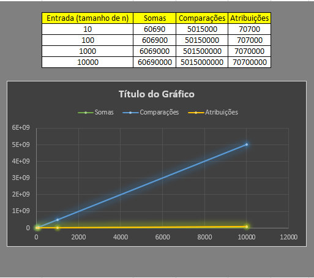
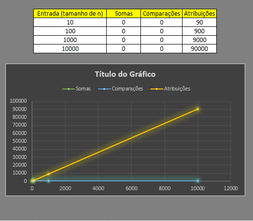

# Documentação da aula de laboratório

Para cada aula de laboratório, salvar print da execução de cada atividade com o resultado da execução do programa.

Atividade I

Alguns números de quatro algarismos possuem uma característica particular, se separam esse número em dois grupos e os somarmos encontramos um outro número cujo quadrada exatamente igual ao número fornecido anteriormente. Veja o exemplo: 
Número =3025 
Separando o número em dois grupos de dois algarismos temos o 30 e o 25 
A soma de 30 com 25 é igual a 55 o O Quadrado de 55 é igual a 3025. 
Faça um programa que mostre os números de 1000 a 9999 que possuem essa característica.

Descrição: 
O codigo a qual realizei irá pegar todos os numeros entre 1 e 9999 e irar pegar os mesmo e dividir a 100 assim todos os numeros que gera essa igualdade ira voltar os 2 primeiros numeros e com modulo irá retorna os 2 ultimos numeros.

Resultado:
   
   

Atividade II 

Um Número é dito primo se possui como divisores o número 1 e ele mesmo. Em outras palavras, um Número Primo possui dois divisores de 1 até ele. 
Faça um programa que mostre se um determinado número inteiro, lido pelo teclado, é Um Número é dito perfeita se a soma de seus divisores menores que ele é igual a ele.  
Por exemplo, o número 6 possui os divisores 1,2 e 3, cuja soma é igual a 6. 
Faça um programa que lista os números perfeitos de 1 a 1000. 

Descrição: 
O codigo a qual realizei o usuário ira inserir um numero e fara o teste na função "primo" se o nº é primo ou não, sendo assim em seguida ele mostrar os numeros perfeitos
de 1 a 1000 como solicitado no enunciado.

Resultado:

Atividade III 

Faça um programa que receba os elementos de dois vetores, A e B, cada um com 5 posições Considere que nenhum dos vetores possui elementos repetidos. 
Crie um vetor resultante C que possua os elementos comuns entre A e B. 
Crie um vetor resultante D que contenha os elementos de A que não existam em B. 

Descrição:
O codigo a qual realizei irá inicialmente pedir para inserir todos os 10 valores dos vetores que irá comparar cada posição com a outra, gerando C elementos comuns
entre A e B, e D os valores diferentes.

Resultado: 

Atividade IV 

Faça um programa que receba os elementos de uma matriz de 5 linhas por 3 colunas. 
Mostre a soma dos elementos de cada uma das linhas e das colunas da matriz. 

Descrição:
O codigo a qual realizei ira pegar todas as linhas e somalas logo depois que informar todos os valores od vetor.
Como demonstrado abaixo o mesmo irá passar o resutlado da soma de cada linha.

Resultado: 

Atividade V

Faça um programa que chame uma função capaz de calcular o Fatorial de um número inteiro

Descrição:
O codigo a qual realizei pede para o usuário inserir o nº qual o mesmo deseje a fatorial daquele nº e realiza o calculo chamando uma função para calcular.

Resultado:

  

Atividade VI
Faça um programa que chame uma função capaz de calcular.x7, sendo e y inteiros:
Utilize passagem de parâmetros por referência.

Descrição:
O codigo a qual realizei pede para o usuário inserir o nº qual o mesmo deseje a Potencia daquele nº e realiza o calculo chamando uma função para calcular a potencia.

Resultado: 

 
 
