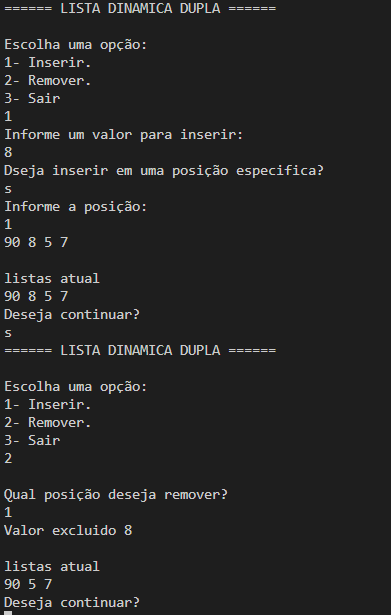
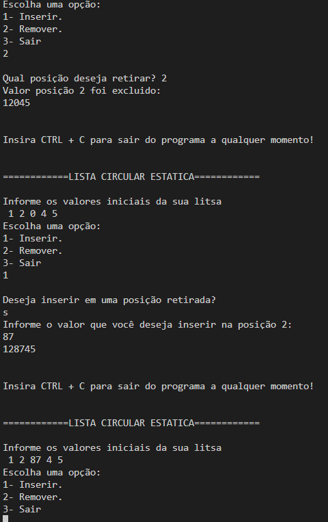
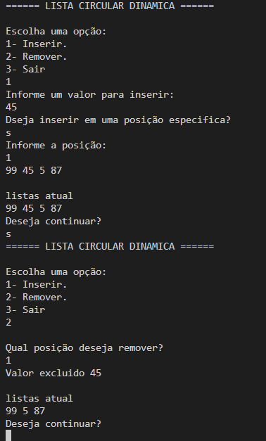

# Documentação da aula de laboratório

Para cada aula de laboratório, salvar print da execução de cada atividade com o resultado da execução do programa.

Atividade I

Lista Duplamente encadeada

Descrição:
    Realizado a criação da Lista duplamente encaminhada, incluindo o ponteiro ant de anterior, assim tanto o prox quanto o ant pecorrem a Lista

Resultado:

Atividade II

Lista Circular statica

Descrição:
    Realizado a criação da lista circular.

Resultado:

Atividade III

Lista Circular Dinamica

Descrição:
    Realizado a lista circular dinamica, apontando primeiro.ant para o ultimo e ultimo.prox para o primeiro.

Resultado:

