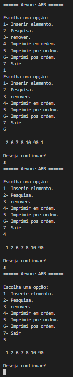
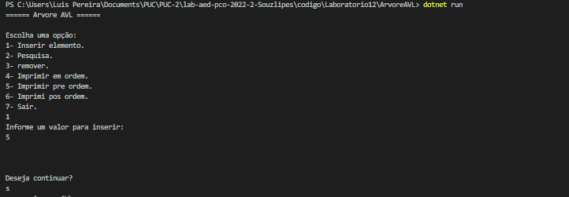
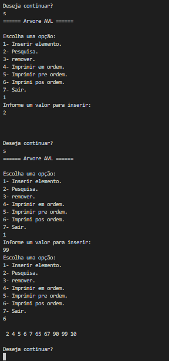

# Documentação da aula de laboratório

Para cada aula de laboratório, salvar print da execução de cada atividade com o resultado da execução do programa.

Atividade I

Arvore ABB

Descrição:
    Realizado a implementação da Arvore abb resursivamente, aonde realizamos a inserção dos Nós e pesquisamos se aquele nó existe ou não na arvores.
    Alem da impressão dos metodos pre ordem, em ordem, e pos ordem.

Resultado:

Atividade II

Arvore AVL

Descrição:
    Realizado a implementação da Arvore AVL resursivamente, aonde realizamos a inserção dos Nós e pesquisamos se aquele nó existe ou não na arvores.
    Foi realizado as implementações das rotações para o balanceamento da arvore.

    Na primeira imagem  podemos ver que a raiz inserida inicialmente é 5, ja na segunda imagem podemos ver 10 como a raiz principal na impressão pos ordem,
    havendo assim o balanceamento

Resultado:

