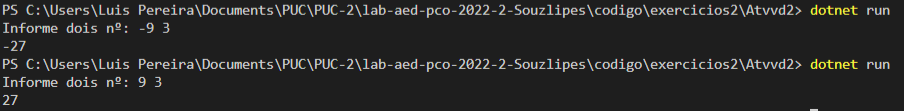

# Documentação da aula de laboratório

Para cada aula de laboratório, salvar print da execução de cada atividade com o resultado da execução do programa.

Atividade I

Escreva um método recursivo que retorne o fatorial de um número.

Descrição: 
O codigo a qual realizei foi apresentado em classe aonde enquanto a variavel "x" não for semelhante a 2, a função chamará ela mesmo
sendo assim aplicando o meotódo recursivo. A melhor opção foi o nº 2 devido qualquer nº multiplicado por 1 é ele mesmo e qualquer soma por 0 é
o valor somado.

Resultado:
   

Atividade II 

Uma multiplicação pode ser vista como uma sequência de somas. 
Escreva um método recursivo que realize a multiplicação de dois números inteiros,
A e B, recebidos por  parâmetro.

Descrição: 
O codigo a qual realizei o usuarios informa o nº a ser multiplicado, com isso o programa irá chamar a função passando esses nº como parâmetros. A função ira analizar
o 2º parâmetro.
Caso o 2º parâmetro maior que 0 a função entra em recursiviadade e irá dimunuir esse 2º parâmetro até 0 chegando em 0 o mesmo entra no metódo de parada, assim desencadeando
todo o processo e somando todo resultado gerado a cada recursivdade somando assim o 1º parâmetro por ele mesmo todas as vezes que entrou em recursividade.
Caso o 2º parâmetro menor que 0  a função entra em recursiviadade e irá apenas somar esse 2º parâmetro até chegar em 0.

Resultado: 

Atividade III 

Escreva um método recursivo que realize a potenciação entre dois números inteiros, A 
e B, recebidos por parâmetro. Seu método deve, portanto, retornar o resultado de A^B

Descrição:
O codigo a qual realizei segue a mesma logica que o anterior, porem ao em vez de somar eu apenas multiplico.
Para caso de potencia negativa a regra de parada será -1 e retornara o 1º paramentro como negativo para potencias impares negativas, como vemos a seguir.

Resultado: 

Atividade IV 

Escreva um método recursivo que receba uma frase e uma letra como parâmetros. 
Este método deve retornar a quantidade de ocorrências desta letra nesta frase.

Descrição:

Resultado: 

Atividade V 

Escreva um método recursivo que calcule a soma dos elementos de valor par de um 
vetor de números inteiros positivos.

Descrição:
O codogio a qual realizei irá transformar todos o numeros impares em 0, em seguida chamará a função para calcular todos os numeros pares
passando cada vetor por um metodo recursivo, chegadando na ultima posição do vetor o mesmo irá resolver a função e somar todos os valores gerados por 
cada vez que realizou a recursiviadade.

Resultado: 

  

Atividade VI
Faça um programa que chame uma função capaz de calcular.x7, sendo e y inteiros:
Utilize passagem de parâmetros por referência.

Resultado: 

 
 
