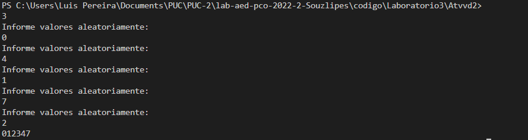
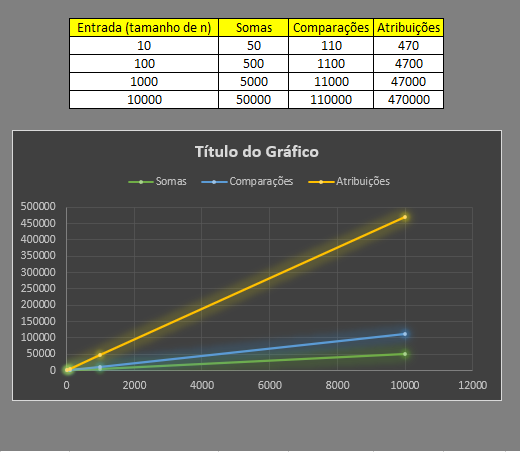

# Documentação da aula de laboratório

Para cada aula de laboratório, salvar print da execução de cada atividade com o resultado da execução do programa.

Atividade I

Escreva um método recursivo que retorne o fatorial de um número.

Descrição: 
O codigo a qual realizei foi apresentado em classe aonde enquanto a variavel "x" não for semelhante a 2, a função chamará ela mesmo
sendo assim aplicando o meotódo recursivo. A melhor opção foi o nº 2 devido qualquer nº multiplicado por 1 é ele mesmo e qualquer soma por 0 é
o valor somado.

Resultado:

