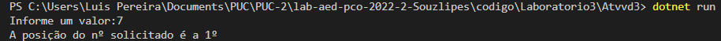

# Documentação da aula de laboratório

Para cada aula de laboratório, salvar print da execução de cada atividade com o resultado da execução do programa.

Atividade I

Ordenação Binaria com pos.

Descrição: 
O codigo a qual realizei foi apresentado em classe o MergeSort, aonde eu realizei por conta própria apenas a intercalação dos subs vetores.

Resultado:

Atividade II

Ordenação Binaria sem pos.

Descrição: 
O codigo a qual realizei foi apresentado em classe o MergeSort, aonde eu realizei por conta própria apenas a intercalção dos subs vetores, sem ultilizar o POS.

Resultado:

Atividade III

Busca Binaria com pos.

Descrição: 
O codigo lhe pede para informa o número a qual deseja realizar a pesquisa, recebendo número o mesmo ordena o vetor e em seguida chama a função para buscar o número informado pelo usuário.

Resultado:

Atividade IV

Busca Binaria Sem pos.

Descrição: 
O codigo lhe pede para informa o número a qual deseja realizar a pesquisa, recebendo número o mesmo ordena o vetor e em seguida chama a função para buscar o número informado pelo usuário.

Resultado:

HHHHHHHHHHHHHHHHHHHHHHHHHHHHHHHHHH,

