# Documentação da aula de laboratório

Para cada aula de laboratório, salvar print da execução de cada atividade com o resultado da execução do programa.

Atividade I

Ordenação Por Bolha. <i>Bubblesort!</i>

Descrição:
O metodo de bolha ultilizado é o classico, sem nem uma alteração do funcionamento, pegando os valores maiores e subindo eles para as partes superiores do vetor ultilizando uma variavels aux para substituições, assim deixando o mesmo ordenado.

Resultado:

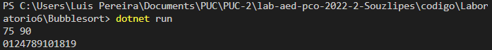
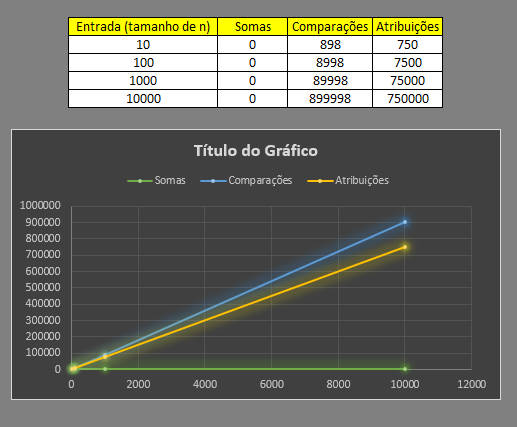

Atividade II

Ordenação por contagem. <i>ContagingSort!</i>

Descrição: 
O metodo de contagem foi realizado da forma aonde se passa o vetor principal na função contagem e o maior numero pertecente a este vetor, para que possa ser aplicado a contagem ate este numero, atribuindo as contagens atraves de um vetor comulativa que pega a quantidade de vezes o numero se repetiu e depois possa acumular essas vezes e organizar o vetor em um novo vetor auxiliar.

Resultado:

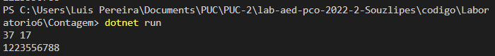
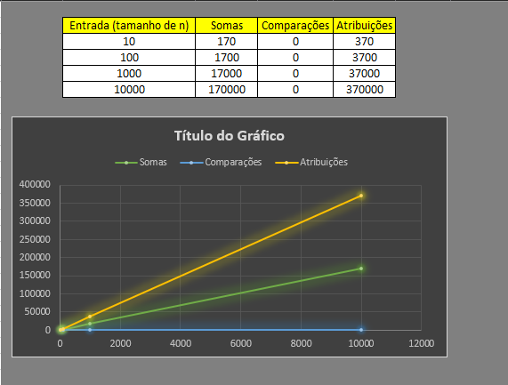

Atividade III

Ordenação por Inserção. <i>InsertSort!</i>

Descrição: 
O  metodo de inserção realizado na atividade também foi feito da maneira classica, selecionando o segundo valor do vetor e comparando com os anteriores, caso menor troca os valores, caso maior pula para o proximo valor de referencia e faz todo o processo novamente de comparação.

Resultado:

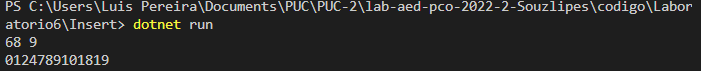
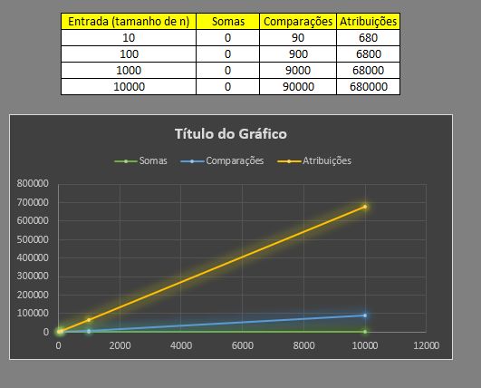

Atividade IV

Ordenação por Mesclagem. <i>MergeSort!</i>

Descrição: 
O codigo a qual realizei foi apresentado em classe o MergeSort, aonde eu realizei por conta própria apenas a intercalação dos subs vetores. Aonde que por meio de um metodo recursivo, é feita a comparação, porém antes dela é feita a divisão dos vetores ate a menor divisão possivel deles e depois compardo um a um  reconstruindo o vetor ja ordenado!

Resultado:

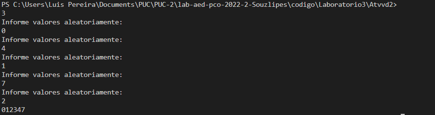
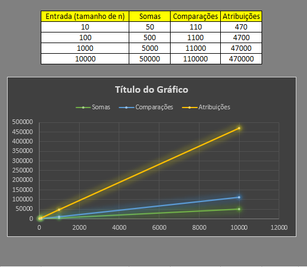

Atividade V

Ordenação pelo metodo rápido. <i>QuickSort!</i>

Descrição: 
O codigo a qual realizei é com base que encontrei para estudo na internet, a diferneça dele para com os demais encontrado e explicado em classe, é que ele usa como pivor o primeiro numero do vetor! Ultiliza uma chamada recursiva bastante similar ao megersort!

Resultado:

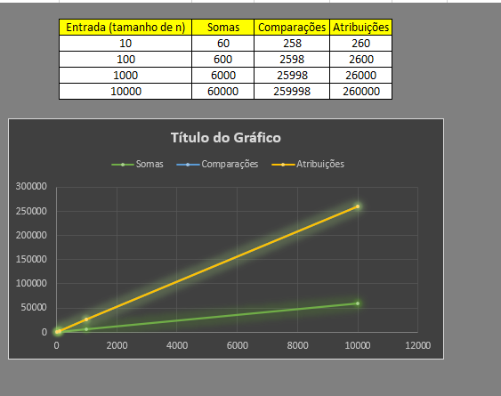

Atividade VI

Ordenação por Seleção. <i>SelectionSort!</i>

Descrição: 
O Selection ele foi ultilizado da maneira classica aonde seleciona o menor valor do vetor e troca pela referencia (primeiro valor do vetor).

Resultado:

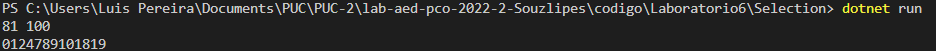
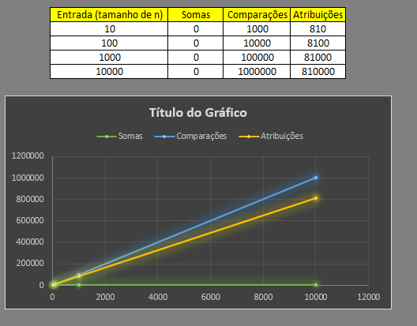

Atividade VI

Ordenação por Seleção. <i>SelectionSort!</i>

Descrição: 
O Selection ele foi ultilizado da maneira classica aonde seleciona o menor valor do vetor e troca pela referencia (primeiro valor do vetor).

Resultado:

Atividade VII

Ordenação pelo metodo de Shell. <i>ShellSort!</i>

Descrição: 
O Shell ele foi ultilizado da maneira classica aonde dividimos o vetor e comparamos seus HOPS(Saltos), cada salto é uma comparação e inserção do menor valor na menor posição comparada.

Resultado:

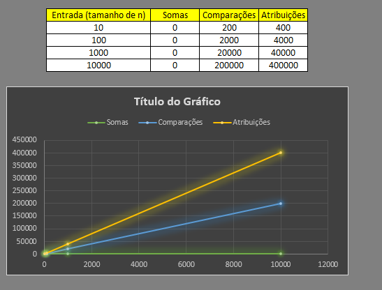