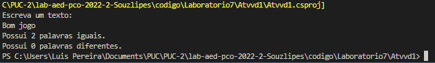
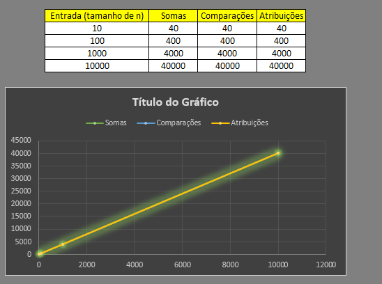
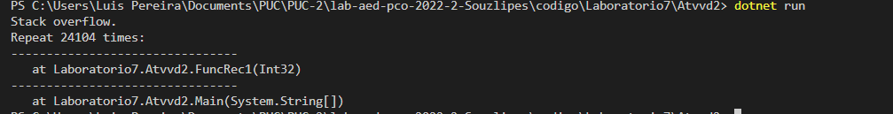
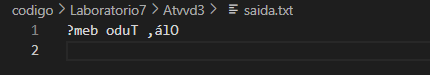
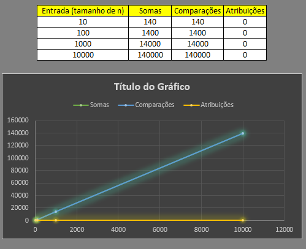
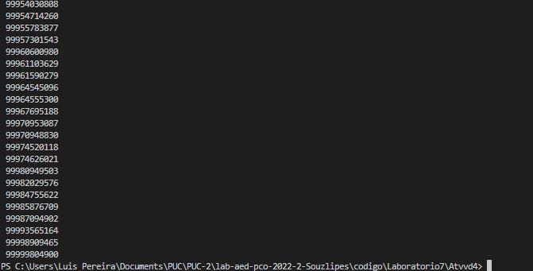
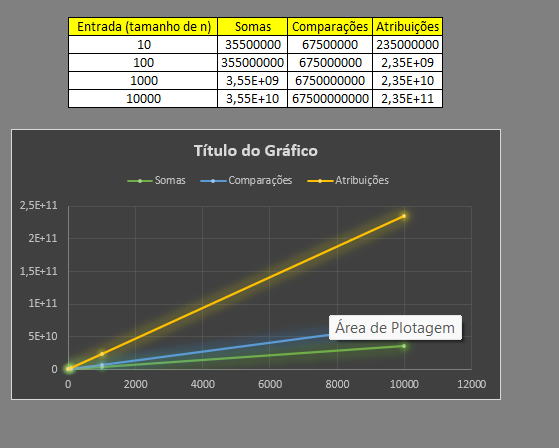
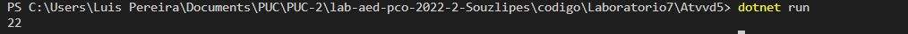
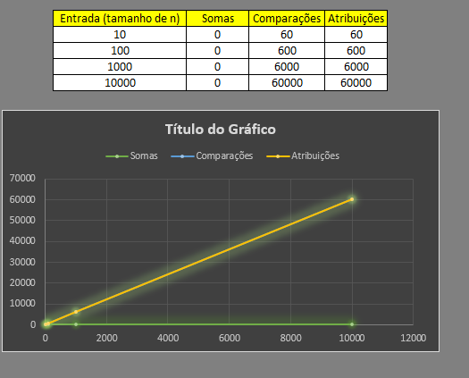

# Documentação da aula de laboratório

Para cada aula de laboratório, salvar print da execução de cada atividade com o resultado da execução do programa.

Atividade I

1. Modele, projete e calcule a complexidade de um programa que:
    a. Leia as linhas de um arquivo chamado "arq1.txt".
    b. Peça para o usuário inserir um texto no terminal/console.
    c. Compare o texto escrito pelo usuário e o texto lido no arquivo, e escreva na tela quantos termos "IGUAIS" e "DIFERENTE".
    d. Descreva quais as operações relevantes.

Descrição:
    Primeiro vamos realizar a leitura do arquivo e armazena-lo em uma string, depois adicionaremos mais uma string para o cliente informa a palavra que ele deseja saber a quantidade de vezes que ela se repete no texto. Com isso usaremos um outra função para trazer esse resultado, e cada letra sera igual trará o resultado de IGUAL, e cada letra diferente trará o resultado de DIFERNETE.

Resultado:

Atividade II

2. Dado o código a seguir, responda:
    a. Quantos e quais são os casos base/condições de parada para a função funcRec10)?
    b. Explique com suas palavras o que a função funcRec1() calcula.
    c. Represente a pilha de execução para a chamada funcRec1(6).

Descrição:
    a. O caso de Para é a menor ou igual a um  sendo assim 0 e 1 tem mais chances de cairem na parada, qualquer numero menor que 0 ja se torna mais dificil.
    b. A função funcRec1() calcula um numero "a" ate o infinito ate dar stackoverflow, sem passar pelo ponto de parada.
    c. Execução do codigo como resultado!

Resultado:

Atividade III

3. Modele, projete e calcule a complexidade de um programa que:
    a. Leia a primeira linha de um arquivo chamado "entrada.txt".
    b. Escreva em um arquivo chamado "saida.txt" o conteudo lido no arquivo de entrada ao contrário.
    c. Descreva quais operações relevantes.

Descrição:
    Primeiro passa, ler o arquivo e guarda em uma variavel string. 
    Com uma função "Invert" vamos inverte de string para um char em array "ToCharArray()", em seguida vamos colocar um contador que começa da maior posição do array ate a menos assim concatenando as ultimas posições em primeiras em uma string.
    Depois retornamos o valor e armazenos ele em um arquvio "Saida.txt"

Resultado:

Atividade IV

4. Um banco famoso enfrenta problemas de consulta em seu banco de registros. Dentre os problemas  
identificados pela gerência está a localização das contas dos seus titulares nas listagens e nos 
relatórios impressos em diferentes situações. Um especialista de lI sugeriu ordenar as contas por meio 
dos CPF dos seus n titulares antes das impressões. Dentre alguns algoritmos pre-selecionados para essa 
ordenação, o especialista escolheu o algoritmo de ordenação por inserção. Se você fosse o especialista, 
responda:

    a. O especialista escolheu um bom algoritimo? Justifique
    b. Qual algoritimo de ordenação ultilizaria?
    c. Descreva quais as operações relevantes.
    d. Demonstre a viabilidade da sua solução para 10 registros

Descrição:
    a. Não, pois o selectionSort tem como complexidade O(n²), pelo banco ter varios clientes ele teria muitos CPF para orderna, por tal motivo o selectionSort não se torna a melhor escolha nesse caso.
    b. Usaria o MergeSort, por ser um algoritio O(n log n), sendo o mais indicado para muitas posições no array.
    c. As trocas feitas por atribuições na hor de desempilhar o MegerSort.
    d. segue o resultado do codigo abaixo.
Resultado:

Atividade IV

5. O código a seguir implementa uma função recursiva. Analise-o indique o que será retornado pela função, caso os parâmetros possuam os seguintes dados: v = {10, 5, 7, 15
22, 9, 30} e a = 6.

Descrição:
    O numero que irá retornara será o 22.
Resultado:

