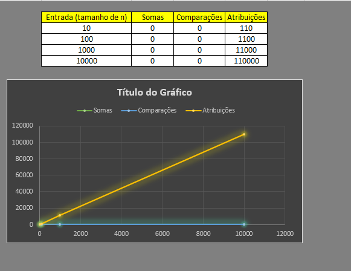
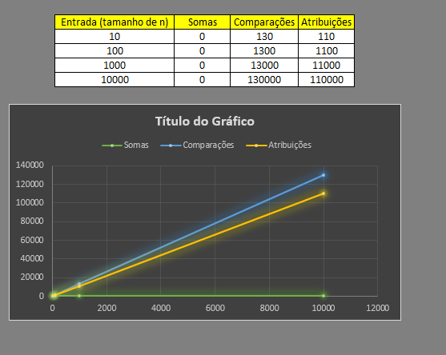

# Documentação da aula de laboratório

Para cada aula de laboratório, salvar print da execução de cada atividade com o resultado da execução do programa.

Atividade I

Fila

Descrição:
    Realizado a criação da fila aonde o primeiro a ser inserido é o primeiro a ser retirado.

Resultado:

Atividade II

Pilha

Descrição:
    Realizado a criação da pilha aonde o ulitmo a ser inserido é o primeiro a ser retirado.

Resultado:

Atividade III

Fila

Descrição:
    Realizado a criação da Fila aonde o usuario escolhe quem retirar e se deseja reenserir na mesma posição.

Resultado:

